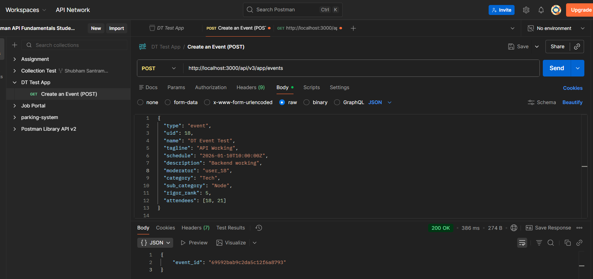
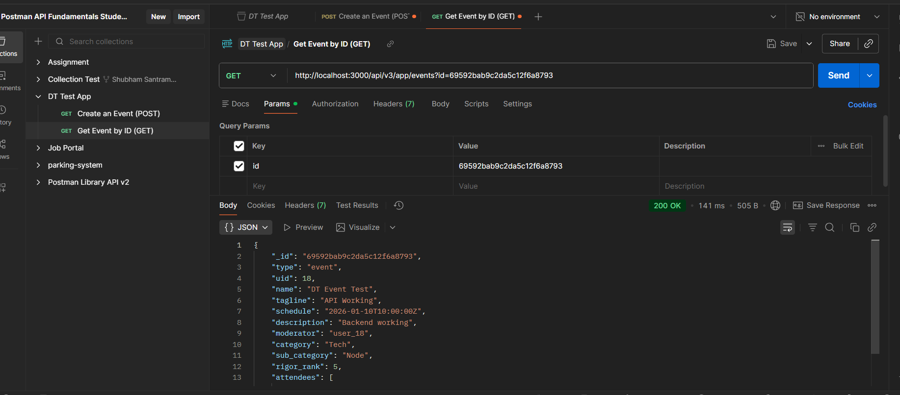
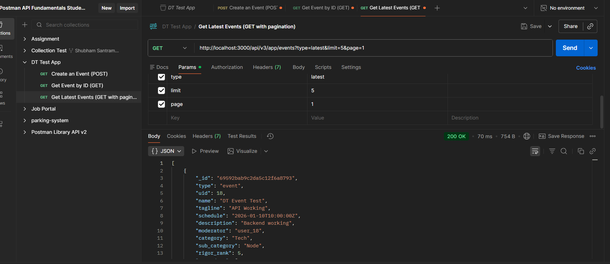
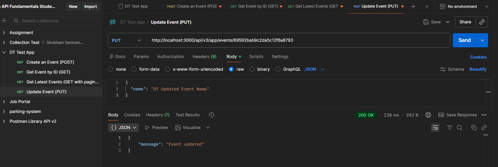
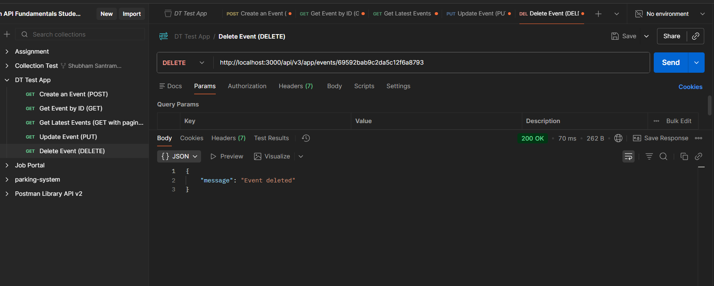

# DT Task 1 – Event API (Backend)

This project contains the backend implementation of the Event APIs for the DT Round 2 assignment.

## Tech Stack
- Node.js
- Express.js
- MongoDB (Native Driver)

## How to Run and Test the API

1. Clone the repository
   `git clone` <https://github.com/Shubham1213s/DT-Task-1-Project-Solutions.git>

2. Navigate to the project directory
   cd `dt-task-1-event-api`

3. Install dependencies
   Run `npm install`

4. Start MongoDB service and Ensure MongoDB is running locally on localhost:27017

5. Start the server
   Run `node server.js`

6. Test the APIs using Postman
   - POST /api/v3/app/events
   - GET /api/v3/app/events?type=latest&limit=5&page=1
   - GET /api/v3/app/events?id=<event_id>

## API Endpoints Implemented
- GET /api/v3/app/events?id=event_id
- GET /api/v3/app/events?type=latest&limit=5&page=1
- POST /api/v3/app/events
- PUT /api/v3/app/events/:id
- DELETE /api/v3/app/events/:id

## Note
- MongoDB native driver is used (no mongoose)
- No fixed schema is defined
- APIs tested using Postman

## Postman API Test Screenshots

### Create Event (POST)

### Get Event by ID (GET)

### Get Latest Events

### Update Event

### Delete Event

